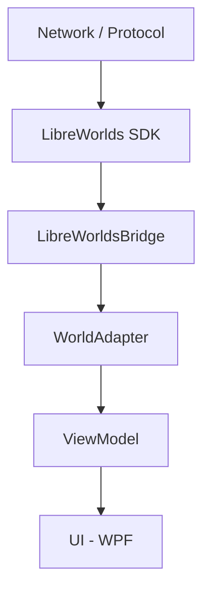

# LibreWorlds.Controller

Native Windows controller application used to **observe, drive, and validate** the real LibreWorlds client pipeline.

## 📝 Overview

`LibreWorlds.Controller` acts as an orchestration and observability layer over the LibreWorlds stack. It wires together the SDK, World Adapter, and runtime engine while exposing their true lifecycle state through a live UI.

> [!IMPORTANT]
> **Real-World State:** If a subsystem indicator is active, that part of the stack is actually connected and running. There are no simulated states or UI-driven shortcuts. This project exists to prove real end-to-end control, not to render worlds.

---

## ⚖️ Scope

### What This Is

* **Lifecycle Controller:** Manages the startup/shutdown flow for LibreWorlds clients.
* **Live Visualization:** Real-time feedback of actual adapter and SDK states.
* **Coordination Surface:** A central hub for bringing various subsystems online.
* **Diagnostic Tool:** Validates integration boundaries and debugs lifecycle issues.
* **"Air Traffic Controller":** Orchestrates complex client startup flows.

### What This Is NOT

* ❌ **Not a renderer:** No 3D/2D graphics engine.
* ❌ **Not a game client:** No gameplay mechanics or player input.
* ❌ **Not a mock UI:** No hardcoded states or fake transitions.
* ❌ **Not a state machine:** It reflects state; it does not invent it.

---

## 🏗 Architecture

The direction of authority is **strictly one-way**. State always flows upward from the SDK into the adapter and finally into the UI.

---

## ✨ Current Capabilities

* **Lifecycle Visualization:** Real-time monitoring of `WorldAdapter` state transitions.
* **Real Transitions:** All state changes are adapter-driven.
* **Architecture Cleanliness:** Strict separation between UI, adapter, and SDK.
* **Signal Propagation:** Verified end-to-end telemetry without simulated data.

---

## 🛠 Intended Use

This project is used during development to:

* **Prove Flow:** Validate connection, authentication, and world-entry sequences.
* **Observe Behavior:** Monitor how the adapter reacts to real SDK events.
* **Debug:** Isolate lifecycle issues without the overhead of a full rendering engine.
* **Coordinate:** Serve as a launch surface for future clients (Godot, native, mobile).

---

Would you like me to add a **License** or **Contributing** section to complete the file?
